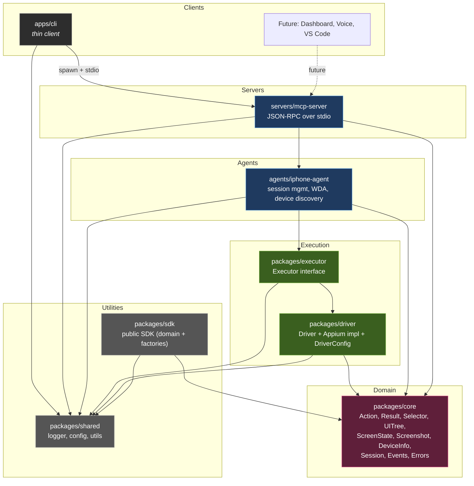

# Athena OS Architecture

## Dependency rules (enforced by `pnpm test:architecture`)

- Edges flow downward only. No package may import a package above its layer.
- Only `packages/driver` may mention Appium/WebDriverAgent.
- `packages/core` has no workspace dependencies; it defines every domain contract.
- The CLI never imports executor/driver/agent — only the MCP client and `shared`.
